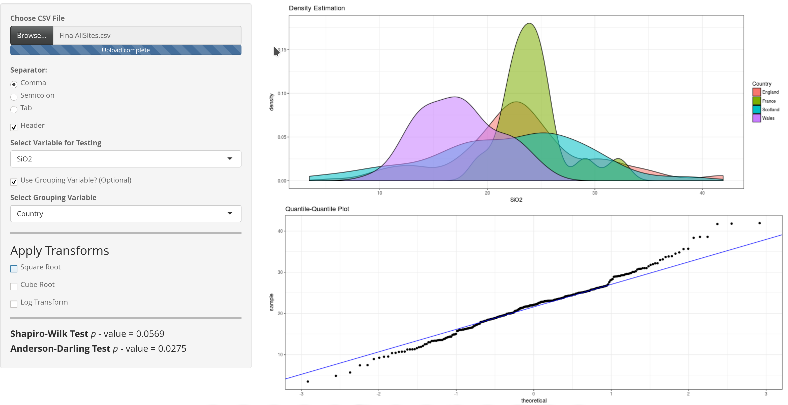

## Usage

This Shiny app is designed to provide a quick, reactive means of uploading any dataset and exploring several popular methods of assessing distribution normality.

Simply upload your data, select the variable you wish to test, and the app will provide:

* The *p*-value of the Shaprio-Wilk test
* The *p*-value of the Anderson-Darling test
* A visualization of the data distribution
* A quantile-quantile plot with a qqline

If there are known groups in your dataset that may be impacting the overall distribution of the tested variable, you can use the **Select Grouping Variable** option to view individual color-coded subset distributions.    

## Transformations

If your data does not appear to be normally distributed, you can see how applying , and logarithmic transformations impact the tests/visualizations. 

